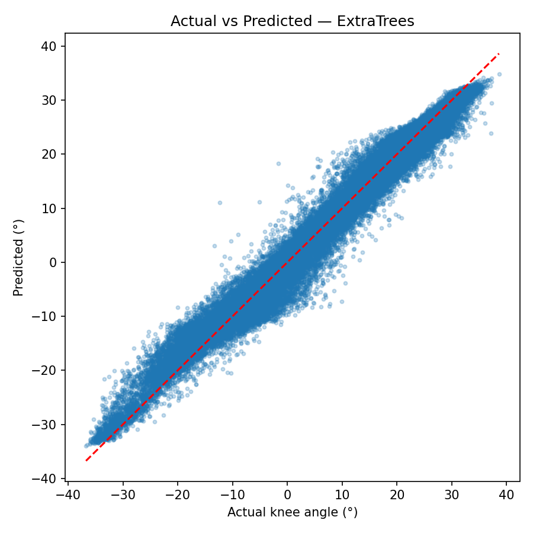
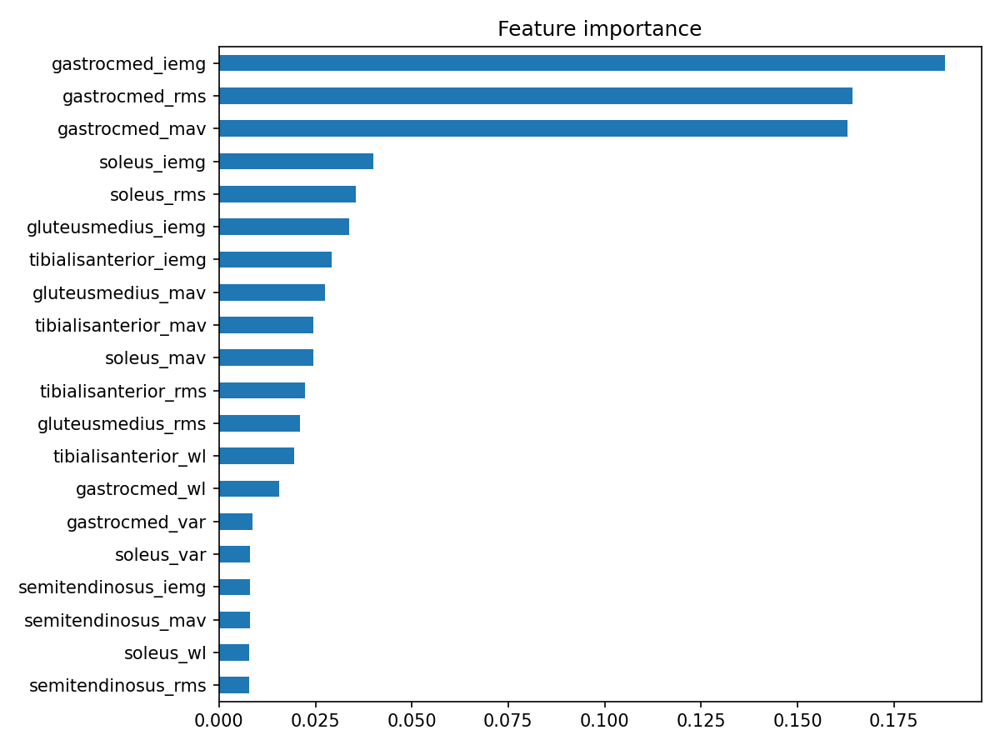
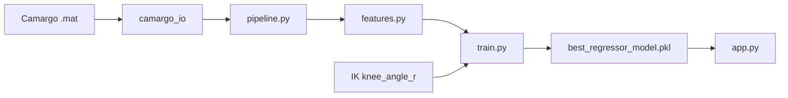

# EMG-Based Knee Angle Prediction for Exoskeleton Control

<p align="center">
  <strong>Predict right knee joint angle from 11-channel surface EMG using the Camargo biomechanics dataset</strong>
</p>

<p align="center">
  
  
  
  
  
</p>

---

## Overview

Surface **electromyography (EMG)** records muscle activation; **inverse kinematics (IK)** provides joint angles during gait. This repository implements a full biomedical pipeline:

1. Load real **Camargo** `.mat` trials (no synthetic training data)
2. DSP: filter, rectify, envelope, normalize, window
3. Extract **77 time-domain features** from 11 muscles
4. Regress **right knee angle** (`knee_angle_r`, degrees)
5. Deploy via **FastAPI** for inference

**Use cases:** powered exoskeletons, rehabilitation robotics, gait analysis, human–machine interfaces.

---

## Results (Camargo, 35 treadmill trials)

| Metric | Value |
|--------|-------|
| **Best model** | RandomForest (60 trees, max_depth=12) |
| **Hold-out R²** (20% trials) | **0.906** |
| **Hold-out RMSE** | **5.06°** |
| **MAE** (full fit) | 2.28° |
| **Samples** | 50,190 windows |
| **Prior baseline** | R² ≈ −0.04 (synthetic demo) |





---

## Dataset

[Camargo et al. — open lower-limb biomechanics](http://www.epic.gatech.edu/opensource-biomechanics-camargo-et-al)

Place `Data_repository_for_Camargo` next to `exoskeleton_pipeline/` or set `CAMARGO_ROOT`.

```
Data_repository_for_Camargo/
  AB06/10_09_18/treadmill/emg/treadmill_01_01.mat   # EMG 1000 Hz, 11 ch
  AB06/10_09_18/treadmill/ik/treadmill_01_01.mat    # IK 200 Hz
```

| Signal | Rate | Channels |
|--------|------|----------|
| EMG | 1000 Hz | 11 muscles (Camargo order) |
| IK knee | 200 Hz → 100 Hz | Column 7 = right knee angle |

Full inventory: `reports/DATASET_REPORT.md`

---

## Pipeline



| Stage | Parameter |
|-------|-----------|
| High-pass | 20 Hz, order 4 |
| Envelope LP | 6 Hz, order 2 |
| Window | 200 ms @ 100 Hz, 50% overlap |
| Time lag | 100 ms (training CSV); **50 ms** optimal on 15-trial Ridge CV — see `reports/LAG_ANALYSIS.md` |
| Split | GroupKFold by `trial_id` (no leakage) |

DSP validation plots: `images/emg_raw_*.png` … `images/emg_downsampled_*.png`

---

## Installation

```bash
cd exoskeleton_pipeline
pip install -r requirements.txt
```

Requires: `numpy`, `scipy`, `pandas`, `scikit-learn`, `matplotlib`, `joblib`, `fastapi`, `uvicorn`

---

## Training (real data only)

```bash
# Full pipeline from .mat files
python train.py --data-root ../Data_repository_for_Camargo --max-files 35 --modes treadmill --skip-lag-search --lag-ms 100

# Fast retrain from saved CSV
python scripts/finish_train.py
```

Outputs:

| File | Description |
|------|-------------|
| `best_regressor_model.pkl` | Model + scaler + 77 feature names |
| `model_metadata.json` | Metrics, verification flags |
| `reports/MODEL_COMPARISON.csv` | Model benchmark |
| `reports/TECHNICAL_REPORT.md` | Full scientific summary |

Verify:

```bash
python -c "import joblib; b=joblib.load('best_regressor_model.pkl'); print('OK', b['model'].__class__.__name__, len(b['feature_names']))"
```

---

## Features (77)

Per muscle (×11): **MAV, RMS, WL, VAR, ZC, SSC, IEMG**

Top contributors (RandomForest): gastrocnemius medialis, tibialis anterior, gluteus medius — see `reports/SHAP_REPORT.md`

---

## API

```bash
uvicorn app:app --host 127.0.0.1 --port 8000
python test_client.py
```

**POST** `/predict` — body:

```json
{
  "emg_window": [[0.0, 0.1, "... 11 channels ..."], "... 200+ rows ..."]
}
```

**GET** `/health` — model load status

Details: `reports/API_REPORT.md`

---

## Project layout

Current package root: `exoskeleton_pipeline/`

```
exoskeleton_pipeline/
├── config.py, pipeline.py, features.py, camargo_io.py
├── train.py, run_pipeline_viz.py, app.py
├── scripts/          # audit, lag, DSP plots, finish_train
├── reports/          # all *.md audit reports + CSV
├── images/           # figures for README & thesis
├── best_regressor_model.pkl
└── requirements.txt, Dockerfile
```

Target modular layout (`src/`, `api/`, `models/`) documented in `reports/REPOSITORY_AUDIT.md` for future refactor.

---

## Reports (16-phase audit)

| Report | Path |
|--------|------|
| Repository | `reports/REPOSITORY_AUDIT.md` |
| Dataset | `reports/DATASET_REPORT.md` |
| Data quality | `reports/DATA_QUALITY_REPORT.md` |
| Sync | `reports/SYNC_REPORT.md` |
| Channels | `reports/CHANNEL_AUDIT.md` |
| Features | `reports/FEATURE_REPORT.md` |
| Lag | `reports/LAG_ANALYSIS.md` |
| Leakage | `reports/LEAKAGE_REPORT.md` |
| Explainability | `reports/SHAP_REPORT.md` |
| API | `reports/API_REPORT.md` |
| Technical | `reports/TECHNICAL_REPORT.md` |

---

## Reproducibility

1. Download Camargo dataset to `Data_repository_for_Camargo/`
2. `python train.py --max-files 35 --modes treadmill --lag-ms 100`
3. Compare metrics in `model_metadata.json`
4. Serve with uvicorn and run `test_client.py`

---

## Future work

- Full 1302-trial training + lag re-export at 50 ms
- Spectral features (mean/median frequency, entropy, Hjorth)
- Sequence models (LSTM / TCN)
- SHAP in dedicated virtual environment
- Real-time loop optimization (&lt;20 ms on edge hardware)

---

## Citation

Camargo, J. et al. *Journal of Biomechanics* — open-source lower-limb biomechanics (stairs, ramps, level ground, treadmill).

---

## Author

Update with your name, email, GitHub, and affiliation for thesis / portfolio submission.
