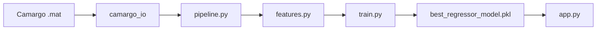

# REPOSITORY_AUDIT

Generated: 2026-05-26T10:47:29.966329Z

## Python modules (exoskeleton_pipeline)

| File | Purpose |
|------|---------|
| `config.py` | Sampling rates, paths, constants |
| `pipeline.py` | EMG DSP + kinematics windowing |
| `features.py` | Time-domain feature extraction |
| `camargo_io.py` | Load Camargo .mat EMG/IK |
| `train.py` | Training, lag search, model benchmark |
| `run_pipeline_viz.py` | Training + DSP visualizations |
| `app.py` | FastAPI inference (11-ch raw EMG) |
| `test_client.py` | API smoke tests |
| `example_config_data.csv` | Example amplitudes (4 ch) — NOT training data |

## Root-level legacy files

| File | Note |
|------|------|
| `pipeline.py` (root) | Older duplicate of DSP |
| `prepare_data.py` | Legacy Camargo loader |
| `*.ipynb` | Exploratory notebooks |

## Data flow

